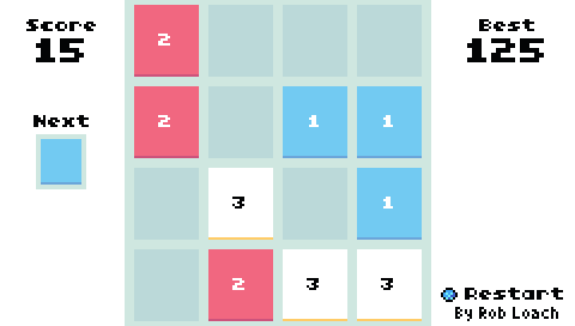

# Threes for TIC-80

> A port of [Threes](http://play.threesgame.com/) to [TIC-80](https://tic.computer/).

**Threes** is an indie puzzle video game by Sirvo, an independent development team consisting of game designer Asher Vollmer, illustrator Greg Wohlwend, and composer Jimmy Hinson. The game was originally released on February 6, 2014. This is a port of Threes to the fantasy console: [TIC-80](https://tic.computer/).



## Usage

[Play online](https://tic.computer/play?cart=911), or [download and install TIC-80](https://tic.computer/create), loading *cart.tic*.

### Gamepad

Use up/right/down/left to move the tiles around. X to restart.

### Mouse/Touch

Swipe the screen to move.

## Development

Run the following to recompile the cart...

```
tic80 cart.tic -code-watch cart.js -sprites sprites.gif
```

## Credits

- TIC-80 Port by [Rob Loach](https://robloach.net)

## License

[GPL-3.0](LICENSE)
